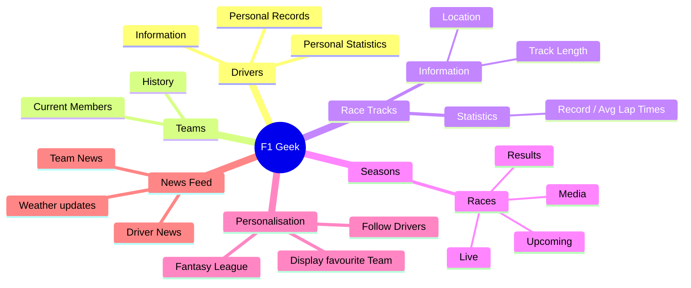

# F1 Geek Design - Version 1

## Mindmap

## User Stories

- As a Formula 1 fan, I want to see a list of drivers so that I can see who is competing in the championship.
- As a Formula 1 fan, I want to see a list of teams so that I can see who is competing in the championship.
- As a Formula 1 fan, I want to drill down into a driver so that I can see more information about them.
- As a Formula 1 fan, I want to drill down into a team so that I can see more information about them, including their drivers.

- As a Formula 1 expert, I want to have access to live weather updates to be able to prepare for race day appropriately.
- As a Formula 1 expert, I want to be able to have all the latest news on teams and players so I am well informed at all times.
- As a Formula 1 expert, I want to have access to live updates to my mobile device from ongoing races I might not be able to attend / watch, so I can keep up to date.

- As a new Formula 1 fan, I want to be able to see team history with past results etc. so I can gain a better understanding of the teams I am watching
- As a new Formula 1 fan, I want to have access to information telling where I can watch the races and at what time. to make it easier to get in on.

## Design

## Data Model - 20%

TODO: Add the mermaid class diagram for the extended data model here, this must be a mermaid diagram that renders in github.

TODO: You must also actually implement the data model in kotlin in your F1 Geek app and include tests, see the previous page for details on the model.

## User Interface - 40%

TODO: Add screenshots of your driver list, team list, team detail screens and driver detail screens
